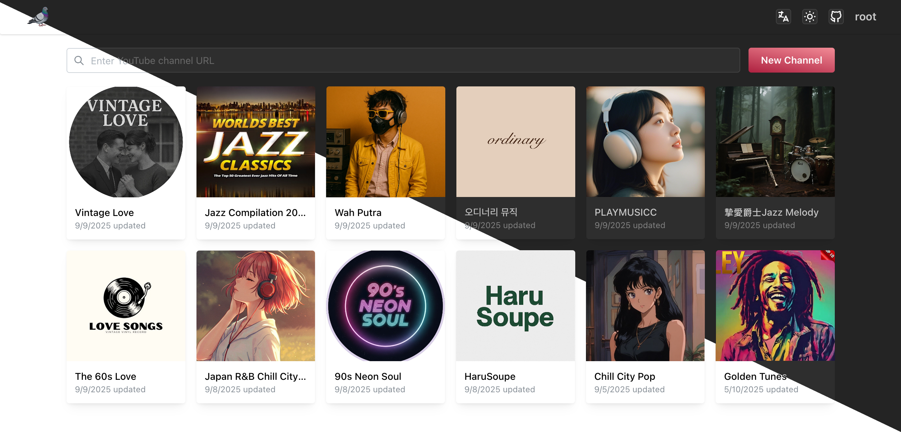

<div align="center">
  
  <h1>PigeonPod</h1>
  <h2>좋아하는 YouTube 채널을 가장 간단하고 우아한 방법으로 팟캐스트 채널로 변환하세요.</h2>
  <h3>셀프 호스팅이 부담스럽다면, 곧 출시될 온라인 서비스를 확인해보세요:
    <a target="_blank" href="https://pigeonpod.asimov.top/">PigeonPod</a>
  </h3>
</div>

<div align="center">
  
[](../../README.md) [](README-ZH.md) [](README-ES.md) [](README-PT.md) [](README-JA.md) [](README-DE.md) [](README-FR.md)
</div>

## 스크린샷


<div align="center">
  <p style="color: gray">채널 목록</p>
</div>


<div align="center">
  <p style="color: gray">채널 상세</p>
</div>

## 핵심 기능

- **🎯 스마트 구독**: YouTube 채널과 재생목록을 한 번에 추가하고 자동으로 동기화합니다.
- **🤖 자동 동기화 업데이트**: 최신 채널 콘텐츠를 자동으로 확인하고 증분 업데이트로 동기화.
- **📻 RSS 팟캐스트 구독**: 표준 RSS 구독 링크 생성, 모든 팟캐스트 클라이언트와 호환.
- **🔍 콘텐츠 필터링**: 키워드 필터링(포함/제외) 및 에피소드 길이 필터링 지원.
- **📊 에피소드 관리**: 에피소드 보기, 삭제, 실패한 에피소드 다운로드 재시도.
- **🎚 오디오 품질 제어**: 0~10 단계의 품질을 선택하거나 원본 트랙을 유지해 음질과 용량을 조절합니다.
- **✨ 광고 없는 청취**: 에피소드에서 인트로 및 중간 광고 자동 제거.
- **🍪 커스텀 쿠키**: 쿠키 업로드를 통한 연령 제한 콘텐츠 및 멤버십 콘텐츠 구독 지원.
- **🌐 다국어 지원**: 영어, 중국어, 스페인어, 포르투갈어, 일본어, 프랑스어, 독일어, 한국어 인터페이스 완전 지원.
- **📱 반응형 UI**: 어떤 기기에서든, 언제 어디서나 뛰어난 경험 제공.

## 배포

### Docker Compose 사용 (권장)

**Docker와 Docker Compose가 시스템에 설치되어 있는지 확인하세요.**

1. docker-compose 설정 파일을 사용하고, 필요에 따라 환경 변수를 수정하세요:
```yml
version: '3.9'
services:
  pigeon-pod:
    # 최신 버전은 https://github.com/aizhimou/pigeon-pod/pkgs/container/pigeon-pod 에서 확인
    image: 'ghcr.io/aizhimou/pigeon-pod:release-1.10.0' 
    restart: unless-stopped
    container_name: pigeon-pod
    ports:
      - '8834:8080'
    environment:
      - 'PIGEON_BASE_URL=https://pigeonpod.asimov.top' # 도메인으로 설정
      - 'PIGEON_AUDIO_FILE_PATH=/data/audio/' # 오디오 파일 경로 설정
      - 'SPRING_DATASOURCE_URL=jdbc:sqlite:/data/pigeon-pod.db' # 데이터베이스 경로 설정
    volumes:
      - data:/data

volumes:
  data:
```

2. 서비스 시작:
```bash
docker-compose up -d
```

3. 애플리케이션 접속:
브라우저를 열고 `http://localhost:8834`에 접속하여 **기본 사용자명: `root`, 기본 비밀번호: `Root@123`**로 로그인

### JAR로 실행

**Java 17+와 yt-dlp가 시스템에 설치되어 있는지 확인하세요.**

1. [Releases](https://github.com/aizhimou/pigeon-pod/releases)에서 최신 릴리스 JAR 다운로드

2. JAR 파일과 같은 디렉토리에 data 디렉토리 생성:
```bash
mkdir -p data
```

3. 애플리케이션 실행:
```bash
java -jar -DPIGEON_BASE_URL=http://localhost:8080 \  # 도메인으로 설정
           -DPIGEON_AUDIO_FILE_PATH=/path/to/your/audio/ \  # 오디오 파일 경로 설정
           -Dspring.datasource.url=jdbc:sqlite:/path/to/your/pigeon-pod.db \  # 데이터베이스 경로 설정
           pigeon-pod-x.x.x.jar
```

4. 애플리케이션 접속:
브라우저를 열고 `http://localhost:8080`에 접속하여 **기본 사용자명: `root`, 기본 비밀번호: `Root@123`**로 로그인

## 문서

- [YouTube API 키 얻는 방법](../how-to-get-youtube-api-key/how-to-get-youtube-api-key-en.md)
- [YouTube 쿠키 설정 방법](../youtube-cookie-setup/youtube-cookie-setup-en.md)
- [YouTube 채널 ID 얻는 방법](../how-to-get-youtube-channel-id/how-to-get-youtube-channel-id-en.md)

## 기술 스택

### 백엔드
- **Java 17** - 핵심 언어
- **Spring Boot 3.5** - 애플리케이션 프레임워크
- **MyBatis-Plus 3.5** - ORM 프레임워크
- **Sa-Token** - 인증 프레임워크
- **SQLite** - 경량 데이터베이스
- **Flyway** - 데이터베이스 마이그레이션 도구
- **YouTube Data API v3** - YouTube 데이터 검색
- **yt-dlp** - 비디오 다운로드 도구
- **Rome** - RSS 생성 라이브러리

### 프론트엔드
- **Javascript (ES2024)** - 핵심 언어
- **React 19** - 애플리케이션 프레임워크
- **Vite 7** - 빌드 도구
- **Mantine 8** - UI 컴포넌트 라이브러리
- **i18next** - 국제화 지원
- **Axios** - HTTP 클라이언트

## 개발 가이드

### 환경 요구사항
- Java 17+
- Node.js 22+
- Maven 3.9+
- SQLite
- yt-dlp

### 로컬 개발

1. 프로젝트 클론:
```bash
git clone https://github.com/aizhimou/PigeonPod.git
cd PigeonPod
```

2. 데이터베이스 설정:
```bash
# 데이터 디렉토리 생성
mkdir -p data/audio

# 데이터베이스 파일은 첫 시작 시 자동으로 생성됩니다
```

3. YouTube API 설정:
   - [Google Cloud Console](https://console.cloud.google.com/)에서 프로젝트 생성
   - YouTube Data API v3 활성화
   - API 키 생성
   - 사용자 설정에서 API 키 구성

4. 백엔드 시작:
```bash
cd backend
mvn spring-boot:run
```

5. 프론트엔드 시작 (새 터미널):
```bash
cd frontend
npm install
npm run dev
```

6. 애플리케이션 접속:
- 프론트엔드 개발 서버: `http://localhost:5173`
- 백엔드 API: `http://localhost:8080`

### 프로젝트 구조
```
pigeon-pod/
├── backend/                 # Spring Boot 백엔드
│   ├── src/main/java/      # Java 소스 코드
│   │   └── top/asimov/pigeon/
│   │       ├── controller/ # REST API 컨트롤러
│   │       ├── service/    # 비즈니스 로직 서비스
│   │       ├── mapper/     # 데이터 접근 계층
│   │       ├── model/      # 데이터 모델
│   │       ├── scheduler/  # 예약된 작업
│   │       └── worker/     # 비동기 워커
│   └── src/main/resources/ # 설정 파일
├── frontend/               # React 프론트엔드
│   ├── src/
│   │   ├── components/     # 재사용 가능한 컴포넌트
│   │   ├── pages/         # 페이지 컴포넌트
│   │   ├── context/       # React Context
│   │   └── helpers/       # 유틸리티 함수
│   └── public/            # 정적 자산
├── data/                  # 데이터 저장 디렉토리
│   ├── audio/            # 오디오 파일
│   └── pigeon-pod.db     # SQLite 데이터베이스
├── docker-compose.yml    # Docker 오케스트레이션 설정
└── Dockerfile           # Docker 이미지 빌드
```

### 개발 참고사항
1. yt-dlp가 설치되어 있고 명령줄에서 사용 가능한지 확인
2. 올바른 YouTube API 키 설정
3. 오디오 저장 디렉토리에 충분한 디스크 공간이 있는지 확인
4. 공간 절약을 위해 정기적으로 오래된 오디오 파일 정리

---

<div align="center">
  <p>팟캐스트 애호가를 위해 ❤️로 제작했습니다!</p>
  <p>⭐ PigeonPod가 마음에 드신다면, GitHub에서 별점을 남겨주세요!</p>
</div>
